### `git clone https://github.com/AshutoshDemoProjects/ShopBridge.git`

#### If you have `Doker` on your system then run below comman in your terminal

> docker-compose up -d

#### If you don't have `Doker`

> then nodejs and mongodb must be install

```
1. cd backend
2. npm install
3. npm start

1. cd frontend
2. npm install
3. npm start
```

application will be start.

first you will get blank page
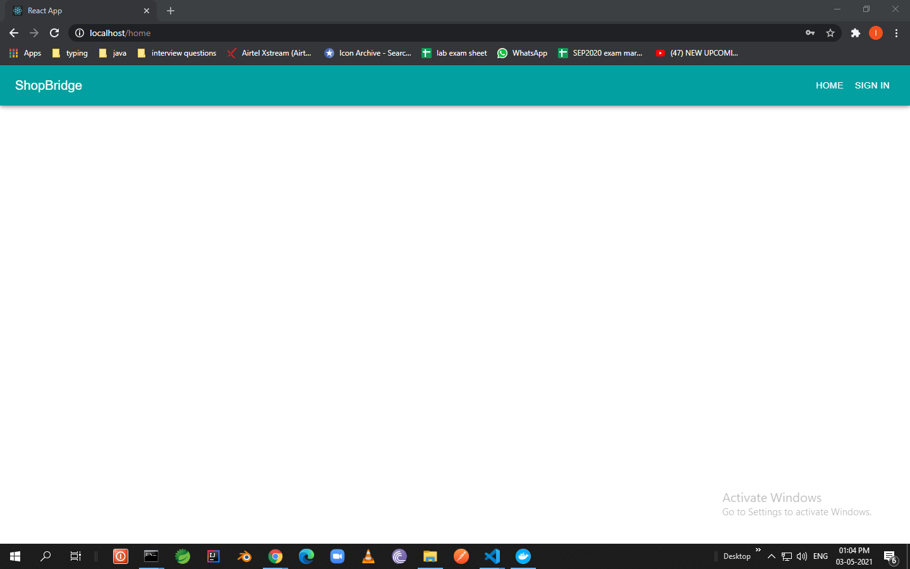

click on singIn
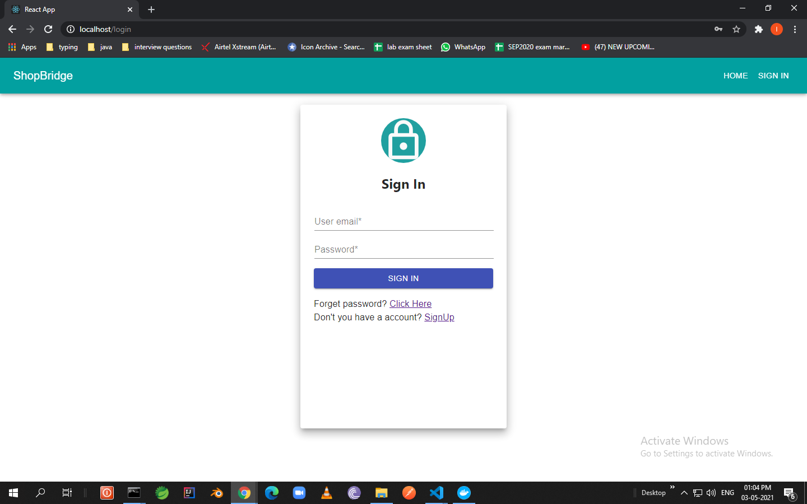

and Signup
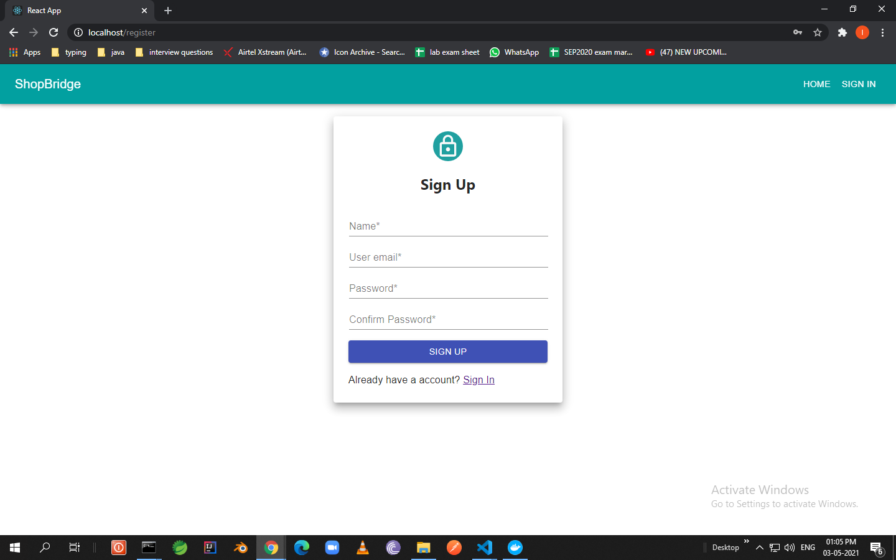

after successfull signup
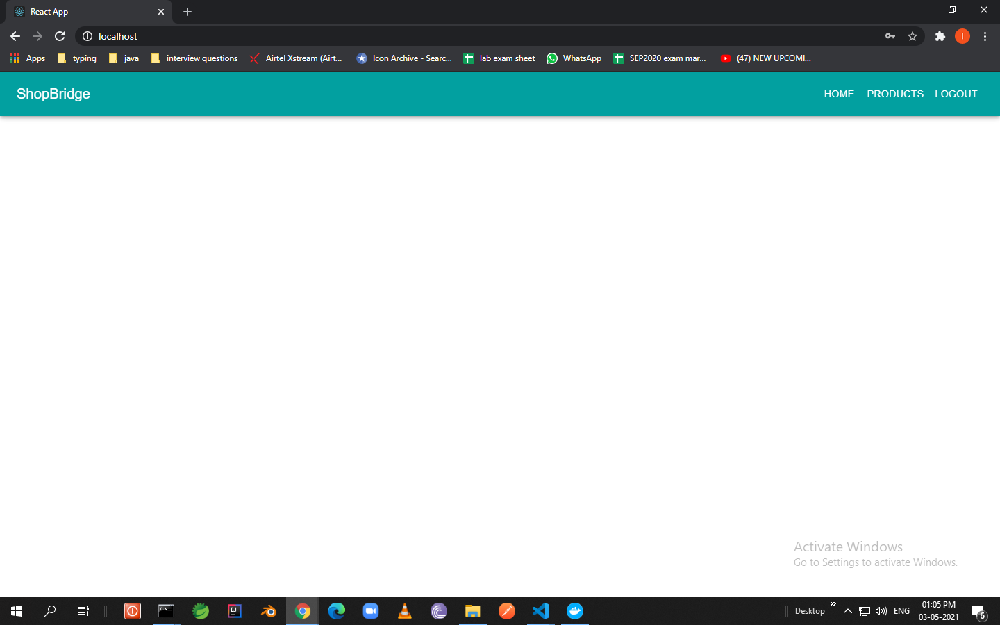

goto Products
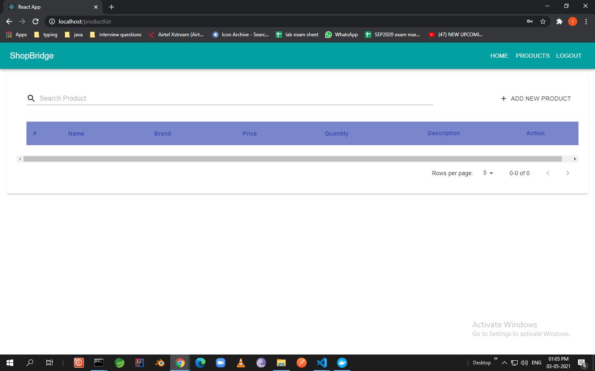

click on add product
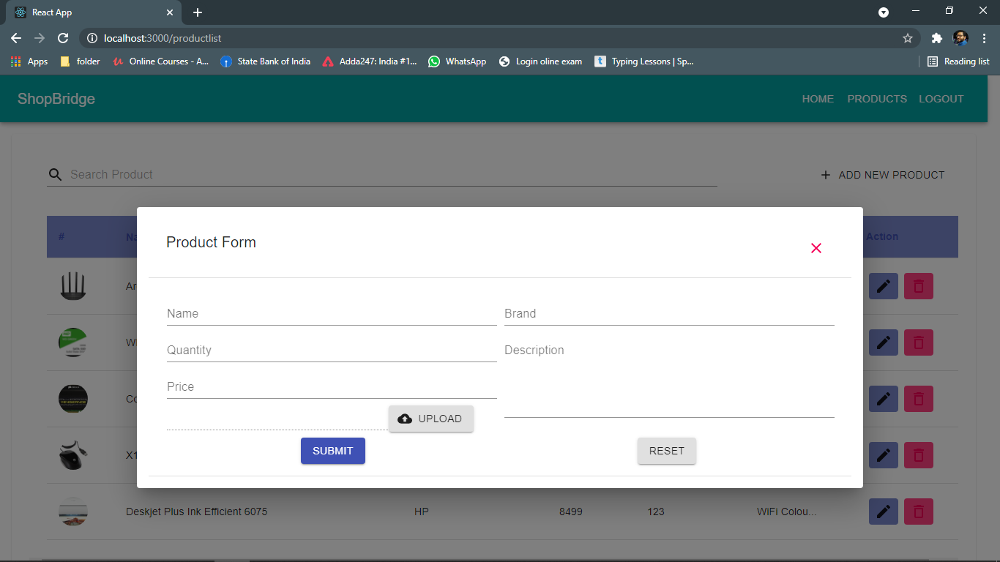

Add product validation
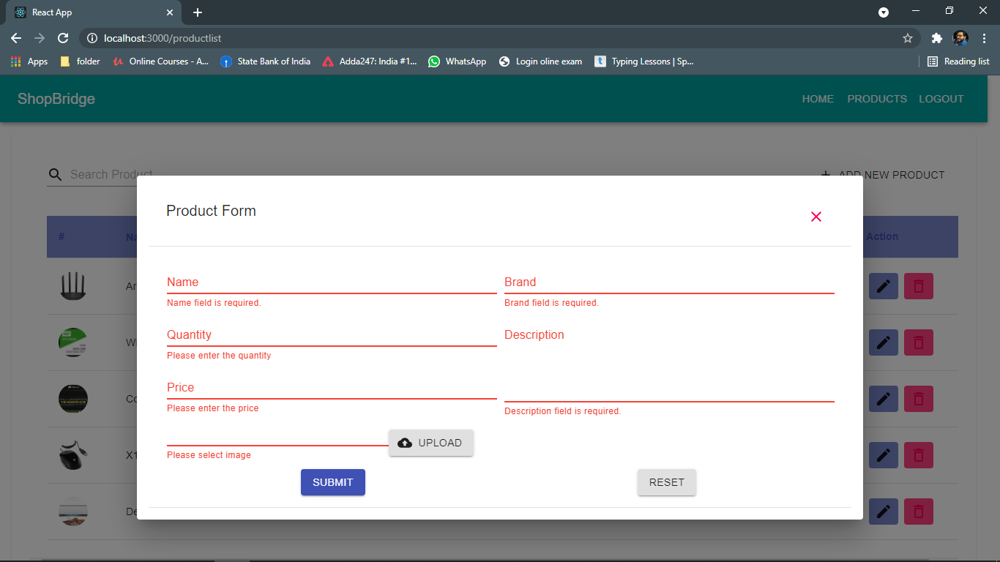

get message
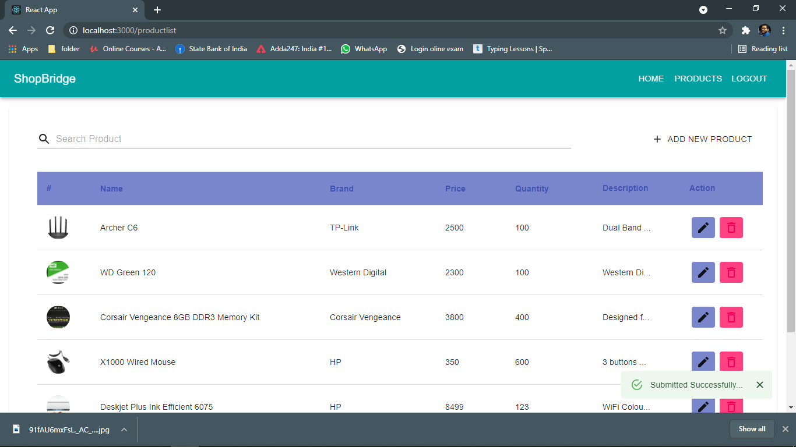

if you want to edit then click on edit button
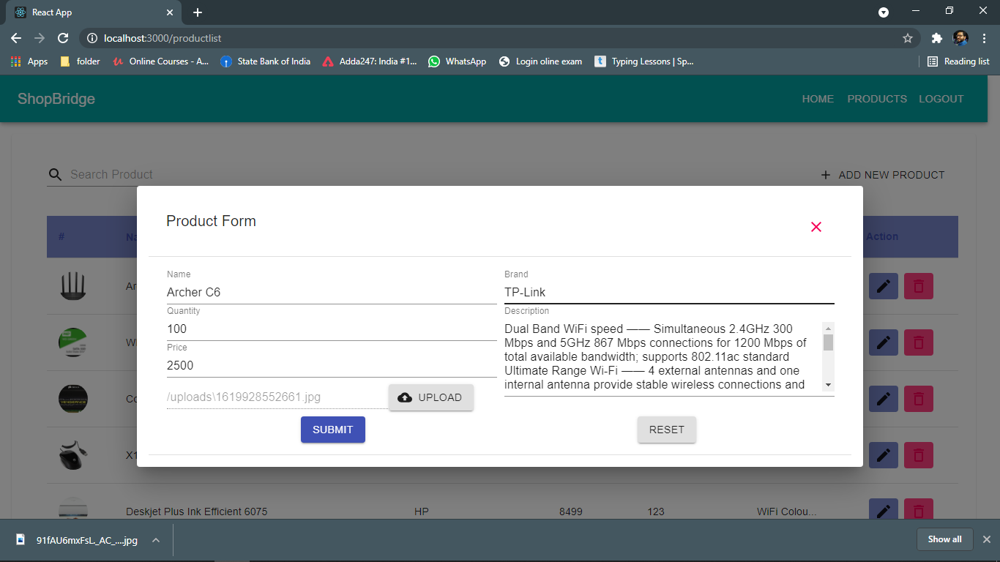

if you want to delete then click on delete button
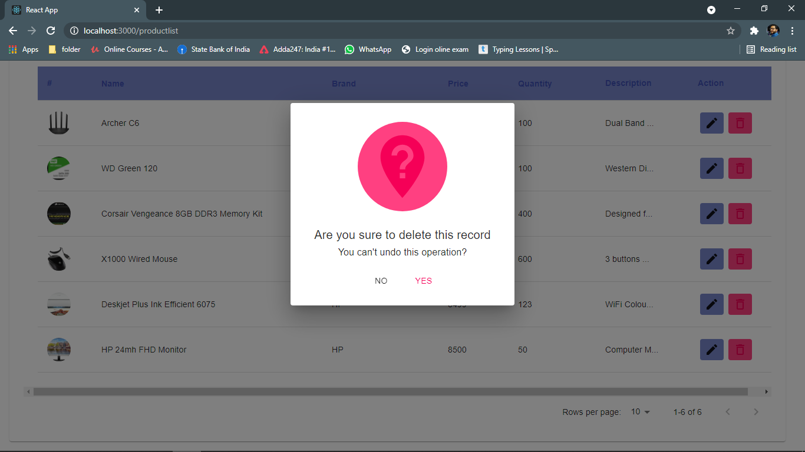

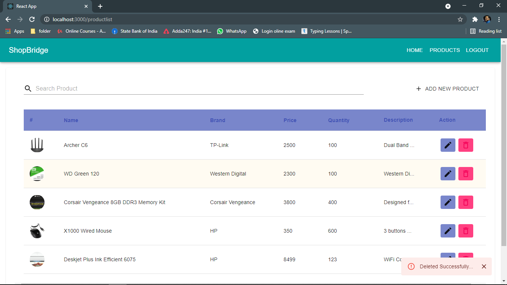
 
After adding some product


After adding some product Home Page look
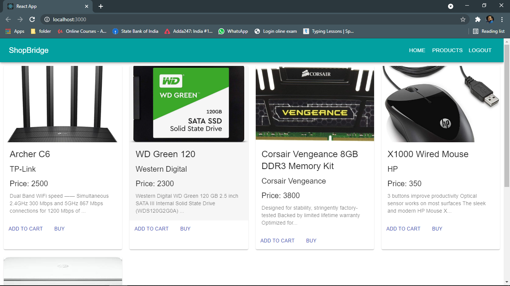
